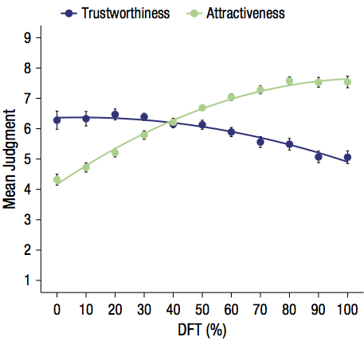

<style type="text/css">
body, td {
   font-size: 14px;
}
h4 { font-size: 14px; }
h3 { font-size: 16px; }
h3.subtitle { font-size: 18px; }
h2 { font-size: 18px; }
h1 { font-size: 24px; }
code, pre, blockquote, ol li {
  font-size: 11px;
}
</style>

```{r, echo=FALSE, include = FALSE}
rm(list=ls())
suppressPackageStartupMessages(c("dplyr","tidyr","ggplot2","lme4"))
library(knitr)
library(tidyr)
library(dplyr)
library(rjson)
library(ggplot2)
library(lme4)
library(langcog) # devtools::install_github("langcog/langcog")

opts_chunk$set(fig.width=8, fig.height=5, 
               echo=TRUE, warning=FALSE, message=TRUE, cache=TRUE)
theme_set(theme_bw())

sem <- function(x) {sd(x, na.rm=TRUE) / sqrt(length(x))}
ci95 <- function(x) {sem(x) * 1.96}
```

# Introduction
In their 2015 APS paper, Sofer et al hypothesized that face typicality affects trustworthiness judgements. Typical faces of varying attractiveness were created from the experiment’s sampled population. Subjects, female students from Hebrew University, were asked to rate these faces on trustworthiness or attractiveness over a 3-week period. They show that for a continuum of faces that vary on a typicality-attractiveness dimension, trustworthiness judgements peak around the typical face. In this replication, we will replicate Study 1 from the original paper.

# Methods

## Power Analysis
Using the effect size $f^2 = 0.15$ with $\alpha = 0.05$ (original power analysis not reported), we did a post-hoc power analysis on the original sample size of 24 participants. To get 80% power, we need 43 participants in each condition, while 90% requires 55 participants and 95% power requires 70% participants. Our target for replication is the "multiple regression analysis in which we predicted the judgments using DFT, DFT-squared, judgment type (trustworthiness = 1, attractiveness = 0), and their interactions (all predictors centered), F(5, 16) = 285.81, p < .001, R2 = .99".

## Planned Sample
The planned sample would be US-based mTurkers, with 45 participants in each condition. We will not be able to replicate the exclusion criteria and instead will restrict the locale to US participants of all genders and all ages. We will collect light demographic information to analyze this difference.

## Materials
The composite images and questionnaire used in the study is available at https://osf.io/8gwnb/.

### Composite images
The stimuli is a series of faces, bookended by a typical face and an attractive composite face with 9 transformations between them (with increments of 10% in the difference of shape and reflectance) resulting in 11 faces. “The typical face was developed by a digital averaging process of 92 faces that were representative of the experiment’s sampled population. Participants whose images were used varied in age from 23 to 31 years old.” “The attractive composite face resulted from digitally averaging the 12 most attractive female faces in Winston, O’Doherty, Kilner, Perrett and Dolan’s (2007) face set.”

### Conditions
**Between-subjects**: 2 conditions, either judging Attractiveness or Trustworthiness.  
**Within-subjects**: 11 stimuli, each judged 3 times per subject.

## Procedure
Participants were randomly assigned into two groups. The first group judged trustworthiness, the other attractiveness.

They first read the instructions for their condition and give their consent:

> By answering the following questions, you are participating in a study being performed by the Stanford Department of Psychology. If you have questions about this research, please contact us at stanfordpysch254@gmail.com. You must be at least 18 years old to participate. Your participation in this research is voluntary. You may decline further participation, at any time, without adverse consequences. Your anonymity is assured; the researchers who have requested your participation will not receive any personal information about you. Note however that we have recently been made aware that your public Amazon.com profile can be accessed via your worker ID if you do not choose to opt out. If you would like to opt out of this feature, you may follow instructions available here.

Next, they read the following text (Introduction screen 1):

For Attractive condition

> Many times we meet strangers for the first time and form our first impression based on their faces. There are faces that look attractive and there are faces that look unattractive.  
>  
> In this experiment different faces will be presented to you and you will be required to judge their attractiveness level. Judgment will be done using a 1 (Definitely not attractive) to 9 (Definitely attractive) scale.  
>  
> There are no right or wrong answers and you are required to answer as soon as you can, after the face is presented.


For Trustworthiness condition

> In this experiment you will be asked to record your first impression of faces. Many times we meet strangers for the first time and form our first impression based on their faces. There are faces that look trustworthy and there are faces that look untrustworthy.  
>  
> In this experiment different faces will be presented to you and you will be required to judge their trustworthiness level. Judgment will be done using a 1 (Definitely not trustworthy) to 9 (Definitely trustworthy) scale.  
>  
> There are no right or wrong answers and you are required to answer as soon as you can, after the face is presented.

Followed by (Introduction screen 2):

> Please read the question again in every new screen and mark your answer for each face before clicking "Next". You will not be able to go back to previous screens.

On each screen, a single face is shown and a Likert-scale from 1 through 9 is shown for either trustworthiness or attractiveness. Each participant is shown each face three times, randomized.

Finally, a debriefing questionnaire (opt-out) is shown:

1. What is your age?
2. What is your gender identity?
3. What is your highest level of education completed?
4. What is your race? Please check all that apply.
5. What in your opinion was the goal of the experiment?
6. If you have any comment about the experiment, please write it here

Separately, we will record the browser’s user agent and window size programmatically.

The study is available at https://web.stanford.edu/~auc/psych254/study1.html

# Analysis Plan
We would like to replicate Figure 2 from the original paper.  

The judgements used for each face are averaged per participant, using the method from Cousineau 2005.  
 		
To mirror the analysis from the original study, we will do the following analysis:

* Regression analysis where we predict the judgements using DFT (distance from typical face), DFT-squared and judgement type (trustworthiness = 1,attractiveness = 0), and their interactions.
* Repeat measures ANOVA with DFT as a repeated measure and judgement type as a between-subjects factor.


# Differences from Original Study
## Sample differences
The first major difference is migrating the experiment to Mechanical Turk. While the original study was done in an online experiment, participants were allowed to perform this at their own pace within a predefined period of 3 weeks. It was also done for course credit. In contrast, our participants complete the experiment in one sitting (advertized as requiring 3 minutes, but participants can take more time if necessary).

We will not be able to replicate the original sample demographic which was rather specific (female students aged 22-33 years old from the Hebrew University in Jerusalem). This might affect our results since the typical face was composed to reflect that demographic. Sofer et al. note that they restricted their study to female participants because men and women perceive feminized faces differently. In the interest of recruiting a broad sample, we allow participants of all genders and will include a supplemental analysis to test whether gender affects responses. Similarly, we will include participants from a wider age range and different location (US instead of Israel) and add supplemental analysis for these additional facets.

## Procedure differences
A minor difference is a small change in the instruction text - our study preloads the images so we do not ask participants to wait for the image to be loaded. We also updated the consent form to that of the Stanford Department of Psychology. We also added a demographic questionnaire at the end to analyze our sample differences and a debrief at the end.


# Results
(from a small pilot study)

## Data preparation

Load the data.

```{r}
path <- "~/code/aucProject/data/"
#folder <- "replication-results/"
folder <- "pilot-b-results/"
files <- dir(paste0(path, folder), pattern = "*.json")
d.raw <- data.frame()
d.balance <- data.frame()

for (f in files) {
  jf <- paste0(path, folder, f)
  jd <- fromJSON(paste(readLines(jf), collapse=""))
  answers <- jd$answers$data
  race <- paste(answers$race, collapse="+")
  id <- data.frame(workerid = jd$WorkerId,
                   race = race,
                   age = answers$age,
                   face_dft = as.numeric(answers$face),
                   face_rating = as.numeric(answers$rating),
                   exp_type = answers$type,
                   elapsed_ms = answers$elapsed_ms,
                   num_errors = answers$num_errors,
                   gender = answers$gender,
                   education = answers$education)
  d.raw <- bind_rows(d.raw, id)
  
  id <- data.frame(workerid = jd$WorkerId,
                   race = race,
                   age = answers$age,
                   exp_type = answers$type,
                   gender = answers$gender,
                   education = answers$education)
  d.balance <- bind_rows(d.balance, id)
}

message("Number of participants: ", length(unique(d.raw$workerid)))
```


### Initial data plots

Simple balance checks:

```{r}
# Balance by gender:
table(d.balance$gender)

# Balance by type:
table(d.balance$exp_type)

# Balance by Face DFT's presented:
table(d.raw$face_dft)

# Balance by age:
table(d.raw$age)
```

Quick check to see distribution of results per participant.

```{r}
ggplot(d.raw, aes(x=face_dft, y=face_rating, color=factor(workerid))) +
  geom_jitter(stat="identity", alpha=0.5) + 
  geom_smooth(method = "loess") +
  facet_wrap(~exp_type)
```


## Confirmatory analysis

Our target for replication is "multiple regression analysis in which we predicted the judgments using DFT, DFT-squared, judgment type (trustworthiness = 1, attractiveness = 0), and their interactions (all predictors centered), F(5, 16) = 285.81, p < .001, R2 = .99".


First, compute within-subjects means and errors across participants.

```{r}
# Within-subjects means
ms <- d.raw %>%
  group_by(exp_type, face_dft, workerid) %>%
  summarise(mean_rating = mean(face_rating))

# Between-subjects errors
cis <- ms %>%
  group_by(exp_type, face_dft) %>%
  summarise(ci=ci95(mean_rating), mean_rating=mean(mean_rating))
```

The authors did a multiple regression analysis which predicted the judgments using DFT, DFT-squared, experiment type and their interactions (all predictors centered).

```{r}
mean_dft <- mean(ms$face_dft)
mean_face_rating <- mean(ms$mean_rating)
centered <- ms %>%
  mutate(centered_face_rating = mean_rating - mean_face_rating,
         centered_dft = face_dft - mean_dft)
model <- lm(centered_face_rating ~
              exp_type + centered_dft + I(centered_dft ** 2) +
              centered_dft * exp_type + 
              I(centered_dft**2) * exp_type,
            centered)
summary(model)
```

To generate Figure 2 from the paper, plot the results of the regression on the within-subjects means with errors across participants:

```{r}
# Calculate predictions based on the model to plot
plotexpl <- expand.grid(centered_dft=seq(-50, 50, 10),
                        exp_type=c("attractive", "trustworthy"))
plotexpl$centered_rating <- predict(model, newdata=plotexpl)

# Uncenter the values
plotexpl <- plotexpl %>%
  mutate(face_rating = centered_rating + mean_face_rating,
         face_dft = centered_dft + mean_dft)

# Plot within-subjects means, between-subjects errors, with predictions from the linear-model
ggplot(cis, aes(x=factor(face_dft), y=mean_rating, color=exp_type, group=exp_type)) +
  geom_point() +
  geom_line(data=plotexpl, aes(y=face_rating, x=factor(face_dft))) +
  geom_errorbar(data=cis,
                aes(y=mean_rating, ymax=mean_rating+ci, ymin=mean_rating-ci),
                width=.25) +
  xlab('DFT %') +
  ylab('Mean Judgment')
```


Finally, the authors computed a by-participant ANOVA with DFT as a repeated measure and experiment type as a between-subjects factor.

```{r}
anova <- aov(mean_rating ~ exp_type + face_dft + Error(workerid / face_dft),
             ms)
summary(anova)
```


## Supplemental analysis

### Exclusions

First, identify outliers.
```{r}
ggplot(d.raw, aes(x=exp_type, y=elapsed_ms)) +
  geom_boxplot()

ggplot(d.raw, aes(x=factor(num_errors), y=elapsed_ms)) +
  geom_boxplot()

ggplot(d.raw, aes(x=factor(face_dft), face_rating)) +
  geom_boxplot() +
  facet_wrap(~exp_type)
```

Also check if participant errors and reaction times (in this paradigm, an error is counted for a trial when the participant tries to submit without selecting a judgment).

```{r}
d.raw %>%
  mutate(error = ifelse(num_errors == 0, "no errors", "some errors")) %>%
  ggplot(aes(x=elapsed_ms)) +
    geom_histogram(bins=20) +
    facet_wrap(~error)
```

We can exclude participants who might not be paying attention to the task (with an outlier reaction time 3 standard-deviations from the mean, or failing to select a result before submitting a judgment which we count as an error). We can also exclude participants who respond too quickly, less than 300ms. This differs from the original study that did not exclude data as far as we can tell.

```{r}
elapsed_upper <- 3 * sd(d.raw$elapsed_ms) + mean(d.raw$elapsed_ms)
d.filter <- d.raw %>%
  filter(num_errors == 0,
         elapsed_ms > 300,
         elapsed_ms < elapsed_upper)
```

### Re-analyze based on filtered data

```{r}
# Within-subjects means
ms <- d.filter %>%
  group_by(exp_type, face_dft, workerid) %>%
  summarise(mean_rating = mean(face_rating))

# Between-subjects errors
cis <- ms %>%
  group_by(exp_type, face_dft) %>%
  summarise(ci=ci95(mean_rating), mean_rating=mean(mean_rating))

# Regression model
mean_dft <- mean(ms$face_dft)
mean_face_rating <- mean(ms$mean_rating)
centered <- ms %>%
  mutate(face_rating = mean_rating - mean_face_rating,
         dft = face_dft - mean_dft)
model <- lm(face_rating ~ exp_type + dft + I(dft ** 2) + dft * exp_type + I(dft**2) * exp_type,
            centered)
summary(model)

# Calculate predictions based on the model to plot
plotexpl <- expand.grid(dft=seq(-50, 50, 10), exp_type=c("attractive", "trustworthy"))
plotexpl$predictions <- predict(model, newdata=plotexpl)

# Uncenter the values
plotexpl <- plotexpl %>%
  mutate(face_rating = predictions + mean_face_rating,
         face_dft = dft + mean_dft)

# Compute new CI's
plotexpl <- plotexpl %>%
  mutate(ci=ci95(face_rating))

ggplot(cis, aes(x=factor(face_dft), y=mean_rating, color=exp_type, group=exp_type)) +
  geom_point() +
  geom_line(data=plotexpl, aes(y=face_rating, x=factor(face_dft))) +
  geom_errorbar(data=cis,
                aes(y=mean_rating, ymax=mean_rating+ci, ymin=mean_rating-ci),
                width=.25) +
  xlab('DFT %') +
  ylab('Mean Judgment')
```

Contrasted against the result from the paper:




### New dependent variables
Verify the effects of dependent variables that differ from original study.

#### Effect of gender
```{r}
ms.gender <- d.raw %>%
  group_by(gender, exp_type, face_dft, workerid) %>%
  summarise(mean = mean(face_rating)) %>%
  group_by(gender, exp_type, face_dft) %>%
  summarise(ci=ci95(mean), mean=mean(mean))

ggplot(ms.gender, aes(x=factor(face_dft), y=mean, color=exp_type, group=exp_type)) +
  geom_point() +
  geom_smooth(method="loess") +
  geom_errorbar(aes(ymax=mean+ci, ymin=mean-ci),
                width=.25) +
  xlab('DFT %') +
  ylab('Mean Judgment') +
  facet_wrap(~gender)
```

#### Effect of age

```{r}
ms.age <- d.raw %>%
  group_by(age, exp_type, face_dft, workerid) %>%
  summarise(mean = mean(face_rating)) %>%
  group_by(age, exp_type, face_dft) %>%
  summarise(ci=ci95(mean), mean=mean(mean))

ggplot(ms.age, aes(x=factor(face_dft), y=mean, color=exp_type, group=exp_type)) +
  geom_point() +
  geom_smooth(method="loess") +
  geom_errorbar(aes(ymax=mean+ci, ymin=mean-ci),
                width=.25) +
  xlab('DFT %') +
  ylab('Mean Judgment') +
  facet_wrap(~age)
```

#### Effect of ethnicity

```{r}
ms.race <- d.raw %>%
  group_by(race, exp_type, face_dft, workerid) %>%
  summarise(mean = mean(face_rating)) %>%
  group_by(race, exp_type, face_dft) %>%
  summarise(ci=ci95(mean), mean=mean(mean))

ggplot(ms.race, aes(x=factor(face_dft), y=mean, color=exp_type, group=exp_type)) +
  geom_point() +
  geom_smooth(method="loess") +
  geom_errorbar(aes(ymax=mean+ci, ymin=mean-ci),
                width=.25) +
  xlab('DFT %') +
  ylab('Mean Judgment') +
  facet_wrap(~race)
```


# Discussion

## Summary of Replication Attempt

## Commentary
