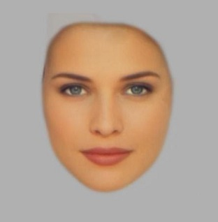

<style type="text/css">
body, td {
   font-size: 14px;
}
h4 { font-size: 14px; }
h3 { font-size: 16px; }
h3.subtitle { font-size: 18px; }
h2 { font-size: 18px; }
h1 { font-size: 24px; }
code, pre, blockquote, ol li {
  font-size: 11px;
}
#composite-images img { width: 150px; }
</style>

```{r, echo=FALSE, include=FALSE}
rm(list=ls())
suppressPackageStartupMessages(c("dplyr","tidyr","ggplot2","lme4"))
library(knitr)
library(tidyr)
library(dplyr)
library(rjson)
library(ggplot2)
library(lme4)
library(langcog) # devtools::install_github("langcog/langcog")

opts_chunk$set(fig.width=8, fig.height=5, 
               echo=TRUE, warning=FALSE, message=TRUE, cache=TRUE)
theme_set(theme_bw())

sem <- function(x) {sd(x, na.rm=TRUE) / sqrt(length(x))}
ci95 <- function(x) {sem(x) * 1.96}
```

```{r, echo=FALSE, include=FALSE}
## Code in this block taken from: http://www.cookbook-r.com/Graphs/Plotting_means_and_error_bars_(ggplot2)

## Gives count, mean, standard deviation, standard error of the mean, and confidence interval (default 95%).
##   data: a data frame.
##   measurevar: the name of a column that contains the variable to be summariezed
##   groupvars: a vector containing names of columns that contain grouping variables
##   na.rm: a boolean that indicates whether to ignore NA's
##   conf.interval: the percent range of the confidence interval (default is 95%)
summarySE <- function(data=NULL, measurevar, groupvars=NULL, na.rm=FALSE,
                      conf.interval=.95, .drop=TRUE) {
    library(plyr)
    # New version of length which can handle NA's: if na.rm==T, don't count them
    length2 <- function (x, na.rm=FALSE) {
        if (na.rm) sum(!is.na(x))
        else       length(x)
    }

    # This does the summary. For each group's data frame, return a vector with
    # N, mean, and sd
    datac <- ddply(data, groupvars, .drop=.drop,
      .fun = function(xx, col) {
        c(N    = length2(xx[[col]], na.rm=na.rm),
          mean = mean   (xx[[col]], na.rm=na.rm),
          sd   = sd     (xx[[col]], na.rm=na.rm)
        )
      },
      measurevar
    )

    # Rename the "mean" column    
    datac <- rename(datac, c("mean" = measurevar))
    datac$se <- datac$sd / sqrt(datac$N)  # Calculate standard error of the mean

    # Confidence interval multiplier for standard error
    # Calculate t-statistic for confidence interval: 
    # e.g., if conf.interval is .95, use .975 (above/below), and use df=N-1
    ciMult <- qt(conf.interval/2 + .5, datac$N-1)
    datac$ci <- datac$se * ciMult

    detach(package:plyr, unload=TRUE)
    return(datac)
}

## Norms the data within specified groups in a data frame; it normalizes each
## subject (identified by idvar) so that they have the same mean, within each group
## specified by betweenvars.
##   data: a data frame.
##   idvar: the name of a column that identifies each subject (or matched subjects)
##   measurevar: the name of a column that contains the variable to be summariezed
##   betweenvars: a vector containing names of columns that are between-subjects variables
##   na.rm: a boolean that indicates whether to ignore NA's
normDataWithin <- function(data=NULL, idvar, measurevar, betweenvars=NULL,
                           na.rm=FALSE, .drop=TRUE) {
    library(plyr)
    # Measure var on left, idvar + between vars on right of formula.
    data.subjMean <- ddply(data, c(idvar, betweenvars), .drop=.drop,
     .fun = function(xx, col, na.rm) {
        c(subjMean = mean(xx[,col], na.rm=na.rm))
      },
      measurevar,
      na.rm
    )

    # Put the subject means with original data
    data <- merge(data, data.subjMean)

    # Get the normalized data in a new column
    measureNormedVar <- paste(measurevar, "_norm", sep="")
    data[,measureNormedVar] <- data[,measurevar] - data[,"subjMean"] +
                               mean(data[,measurevar], na.rm=na.rm)

    # Remove this subject mean column
    data$subjMean <- NULL
    
    detach(package:plyr, unload=TRUE)
    return(data)
}

## Summarizes data, handling within-subjects variables by removing inter-subject variability.
## It will still work if there are no within-S variables.
## Gives count, un-normed mean, normed mean (with same between-group mean),
##   standard deviation, standard error of the mean, and confidence interval.
## If there are within-subject variables, calculate adjusted values using method from Morey (2008).
##   data: a data frame.
##   measurevar: the name of a column that contains the variable to be summariezed
##   betweenvars: a vector containing names of columns that are between-subjects variables
##   withinvars: a vector containing names of columns that are within-subjects variables
##   idvar: the name of a column that identifies each subject (or matched subjects)
##   na.rm: a boolean that indicates whether to ignore NA's
##   conf.interval: the percent range of the confidence interval (default is 95%)
summarySEwithin <- function(data=NULL, measurevar, betweenvars=NULL, withinvars=NULL,
                            idvar=NULL, na.rm=FALSE, conf.interval=.95, .drop=TRUE) {
  # Ensure that the betweenvars and withinvars are factors
  factorvars <- vapply(data[, c(betweenvars, withinvars), drop=FALSE],
    FUN=is.factor, FUN.VALUE=logical(1))

  if (!all(factorvars)) {
    nonfactorvars <- names(factorvars)[!factorvars]
    message("Automatically converting the following non-factors to factors: ",
            paste(nonfactorvars, collapse = ", "))
    data[nonfactorvars] <- lapply(data[nonfactorvars], factor)
  }

  # Get the means from the un-normed data
  datac <- summarySE(data, measurevar, groupvars=c(betweenvars, withinvars),
                     na.rm=na.rm, conf.interval=conf.interval, .drop=.drop)

  # Drop all the unused columns (these will be calculated with normed data)
  datac$sd <- NULL
  datac$se <- NULL
  datac$ci <- NULL

  # Norm each subject's data
  ndata <- normDataWithin(data, idvar, measurevar, betweenvars, na.rm, .drop=.drop)

  # This is the name of the new column
  measurevar_n <- paste(measurevar, "_norm", sep="")

  # Collapse the normed data - now we can treat between and within vars the same
  ndatac <- summarySE(ndata, measurevar_n, groupvars=c(betweenvars, withinvars),
                      na.rm=na.rm, conf.interval=conf.interval, .drop=.drop)

  # Apply correction from Morey (2008) to the standard error and confidence interval
  #  Get the product of the number of conditions of within-S variables
  nWithinGroups    <- prod(vapply(ndatac[,withinvars, drop=FALSE], FUN=nlevels,
                           FUN.VALUE=numeric(1)))
  correctionFactor <- sqrt( nWithinGroups / (nWithinGroups-1) )

  # Apply the correction factor
  ndatac$sd <- ndatac$sd * correctionFactor
  ndatac$se <- ndatac$se * correctionFactor
  ndatac$ci <- ndatac$ci * correctionFactor

  # Combine the un-normed means with the normed results
  merge(datac, ndatac)
}
```

# Introduction
In their 2015 APS paper, Sofer et al hypothesized that face typicality affects trustworthiness judgements. Typical faces of varying attractiveness were created from the experiment’s sampled population. Subjects, female students from Hebrew University, were asked to rate these faces on trustworthiness or attractiveness over a 3-week period. They show that for a continuum of faces that vary on a typicality-attractiveness dimension, trustworthiness judgements peak around the typical face. In this replication, we will replicate Study 1 from the original paper.

# Methods

## Power Analysis
Using the effect size $f^2 = 0.15$ with $\alpha = 0.05$ (original power analysis not reported), we did a post-hoc power analysis on the original sample size of 24 participants. To get 80% power, we need 43 participants in each condition, while 90% requires 55 participants and 95% power requires 70% participants. Our target for replication is the "multiple regression analysis in which we predicted the judgments using DFT, DFT-squared, judgment type (trustworthiness = 1, attractiveness = 0), and their interactions (all predictors centered), $F(5, 16) = 285.81, p < .001, R^2 = .99$".

## Planned Sample
The planned sample would be US-based mTurkers, with 45 participants in each condition. We will not be able to replicate the exclusion criteria and instead will restrict the locale to US participants of all genders and all ages. We will collect light demographic information to analyze this difference.

## Materials
The composite images and questionnaire used in the study is available at https://osf.io/8gwnb/.

### Composite images
The stimuli is a series of faces, bookended by a typical face and an attractive composite face with 9 transformations between them (with increments of 10% in the difference of shape and reflectance) resulting in 11 faces. “The typical face was developed by a digital averaging process of 92 faces that were representative of the experiment’s sampled population. Participants whose images were used varied in age from 23 to 31 years old.” “The attractive composite face resulted from digitally averaging the 12 most attractive female faces in Winston, O’Doherty, Kilner, Perrett and Dolan’s (2007) face set.”


DFT 0 (typical)                     | DFT 50                              | DFT 100 (attractive)
------------------------------------|-------------------------------------|----------------
 |  | 


### Conditions
**Between-subjects**: 2 conditions, either judging Attractiveness or Trustworthiness.  
**Within-subjects**: 11 stimuli, each judged 3 times per subject.

## Procedure
Participants were randomly assigned into two groups. The first group judged trustworthiness, the other attractiveness.

They first read the instructions for their condition and give their consent:

> By answering the following questions, you are participating in a study being performed by the Stanford Department of Psychology. If you have questions about this research, please contact us at stanfordpysch254@gmail.com. You must be at least 18 years old to participate. Your participation in this research is voluntary. You may decline further participation, at any time, without adverse consequences. Your anonymity is assured; the researchers who have requested your participation will not receive any personal information about you. Note however that we have recently been made aware that your public Amazon.com profile can be accessed via your worker ID if you do not choose to opt out. If you would like to opt out of this feature, you may follow instructions available here.

Next, they read the following text (Introduction screen 1):

For Attractive condition

> Many times we meet strangers for the first time and form our first impression based on their faces. There are faces that look attractive and there are faces that look unattractive.  
>  
> In this experiment different faces will be presented to you and you will be required to judge their attractiveness level. Judgment will be done using a 1 (Definitely not attractive) to 9 (Definitely attractive) scale.  
>  
> There are no right or wrong answers and you are required to answer as soon as you can, after the face is presented.


For Trustworthiness condition

> In this experiment you will be asked to record your first impression of faces. Many times we meet strangers for the first time and form our first impression based on their faces. There are faces that look trustworthy and there are faces that look untrustworthy.  
>  
> In this experiment different faces will be presented to you and you will be required to judge their trustworthiness level. Judgment will be done using a 1 (Definitely not trustworthy) to 9 (Definitely trustworthy) scale.  
>  
> There are no right or wrong answers and you are required to answer as soon as you can, after the face is presented.

Followed by (Introduction screen 2):

> Please read the question again in every new screen and mark your answer for each face before clicking "Next". You will not be able to go back to previous screens.

On each screen, a single face is shown and a Likert-scale from 1 through 9 is shown for either trustworthiness or attractiveness. Each participant is shown each face three times, randomized.

Finally, a debriefing questionnaire (opt-out) is shown:

1. What is your age?
2. What is your gender identity?
3. What is your highest level of education completed?
4. What is your race? Please check all that apply.
5. What in your opinion was the goal of the experiment?
6. If you have any comment about the experiment, please write it here

Separately, we will record the browser’s user agent and window size programmatically.

The study is available at https://web.stanford.edu/~auc/psych254/study1.html

# Analysis Plan
We would like to replicate Figure 2 from the original paper.  

The judgements used for each face are averaged per participant, using the method from Cousineau 2005.  
 		
To mirror the analysis from the original study, we will do the following analysis:

* Regression analysis where we predict the judgements using DFT (distance from typical face), DFT-squared and judgement type (trustworthiness = 1,attractiveness = 0), and their interactions.
* Repeat measures ANOVA with DFT as a repeated measure and judgement type as a between-subjects factor.


# Differences from Original Study
## Sample differences
The first major difference is migrating the experiment to Mechanical Turk. While the original study was done in an online experiment, participants were allowed to perform this at their own pace within a predefined period of 3 weeks. It was also done for course credit. In contrast, our participants complete the experiment in one sitting (advertized as requiring 3 minutes, but participants can take more time if necessary).

We will not be able to replicate the original sample demographic which was rather specific (female students aged 22-33 years old from the Hebrew University in Jerusalem). This might affect our results since the typical face was composed to reflect that demographic. Sofer et al. note that they restricted their study to female participants because men and women perceive feminized faces differently. In the interest of recruiting a broad sample, we allow participants of all genders and will include a supplemental analysis to test whether gender affects responses. Similarly, we will include participants from a wider age range and different location (US instead of Israel) and add supplemental analysis for these additional facets.

## Procedure differences
A minor difference is a small change in the instruction text - our study preloads the images so we do not ask participants to wait for the image to be loaded. We also updated the consent form to that of the Stanford Department of Psychology. We also added a demographic questionnaire at the end to analyze our sample differences and a debrief at the end.


# Results
(from a small pilot study)

## Data preparation

Load the data.

```{r}
path <- "~/code/aucProject/data/"
folder <- "replication-results/"
files <- dir(paste0(path, folder), pattern = "*.json")
d.raw <- data.frame()
d.balance <- data.frame()

for (f in files) {
  jf <- paste0(path, folder, f)
  jd <- fromJSON(paste(readLines(jf), collapse=""))
  answers <- jd$answers$data
  race <- paste(answers$race, collapse="+")
  id <- data.frame(workerid = jd$WorkerId,
                   race = race,
                   age = answers$age,
                   face_dft = as.numeric(answers$face),
                   face_rating = as.numeric(answers$rating),
                   exp_type = answers$type,
                   elapsed_ms = answers$elapsed_ms,
                   num_errors = answers$num_errors,
                   gender = answers$gender,
                   education = answers$education)
  d.raw <- bind_rows(d.raw, id)
  
  id <- data.frame(workerid = jd$WorkerId,
                   race = race,
                   age = answers$age,
                   exp_type = answers$type,
                   gender = answers$gender,
                   education = answers$education)
  d.balance <- bind_rows(d.balance, id)
}

message("Number of participants: ", length(unique(d.raw$workerid)))
```


### Initial data plots

Simple balance checks:

```{r}
# Balance by gender:
table(d.balance$gender)

# Balance by type:
table(d.balance$exp_type)

# Balance by Face DFT's presented:
table(d.raw$face_dft)

# Balance by age:
table(d.balance$age)

# Balance by ethnicity:
table(d.balance$race)
```

```{r}
ggplot(d.raw, aes(x=face_rating, fill=exp_type)) +
  geom_histogram(bins=20)
```

This histogram shows us the judgements were not normally distributed and skewed to the left.

Quick check to see distribution of results per participant.

```{r}
ggplot(d.raw, aes(x=face_dft, y=face_rating, color=factor(workerid))) +
  geom_jitter(stat="identity", alpha=0.5) + 
  geom_smooth(method = "loess", se=F) +
  facet_wrap(~exp_type) +
  xlab('DFT %') +
  ylab('Judgment')
```

This graph shows high variablity in the judgements across participants, especially in the "Trustworthy" condition where there appears to be no clear trend in judgements as face rating changes. It's also interesting to note that for a 2 participants in the "Trustworthy" condition, their judgments are lower than 5 across DFT.

## Confirmatory analysis

Our target for replication is "multiple regression analysis in which we predicted the judgments using DFT, DFT-squared, judgment type (trustworthiness = 1, attractiveness = 0), and their interactions (all predictors centered), F(5, 16) = 285.81, p < .001, R2 = .99".


First, compute within-subjects standard errors across participants using Cousineau 2005 (code from http://www.cookbook-r.com/Graphs/Plotting_means_and_error_bars_(ggplot2)/ shown at the end of the document).

```{r, warning=FALSE, message=FALSE}
d.errors <- summarySEwithin(d.raw, measurevar="face_rating", withinvars=c("face_dft", "exp_type"),
                            idvar="workerid", na.rm=FALSE, conf.interval=.95)
```


The authors did a multiple regression analysis which predicted the judgments using DFT, DFT-squared, experiment type and their interactions (all predictors centered).

```{r}
mean_dft <- mean(as.numeric(as.character(d.errors$face_dft)))
mean_face_rating <- mean(d.errors$face_rating_norm)
centered <- d.errors %>%
  mutate(centered_face_rating = face_rating_norm - mean_face_rating,
         centered_dft = as.numeric(as.character(face_dft)) - mean_dft)
model <- lm(centered_face_rating ~
              exp_type + centered_dft + I(centered_dft ** 2) +
              centered_dft * exp_type + 
              I(centered_dft**2) * exp_type,
            centered)
summary(model)
```

This results in $F(5, 16) = 91.11, p < 0.001, R^2 = 0.97$ which is the same significance level and effect size as the original study. Comparing the coeffecient estimates from this model with that of the original study, the terms have the same sign though in absolute terms, ours are all less than 0.1. The original study found significant effects for all the coefficients, though we did not find significance for the judgement type and judgement type and DFT-squared.


To generate Figure 2 from the paper, plot the results of the regression on the between-subjects means with standard errors across participants:

```{r}
# Calculate predictions based on the model to plot
plotexpl <- expand.grid(centered_dft=seq(-50, 50, 10),
                        exp_type=c("attractive", "trustworthy"))
plotexpl$centered_rating <- predict(model, newdata=plotexpl)

# Uncenter the values
plotexpl <- plotexpl %>%
  mutate(face_rating = centered_rating + mean_face_rating,
         face_dft = centered_dft + mean_dft)

# Plot between-subjects means, between-subjects errors, with predictions from the linear-model
ggplot(d.errors, aes(x=factor(face_dft), y=face_rating_norm, color=exp_type, group=exp_type)) +
  geom_point() +
  geom_line(data=plotexpl, aes(y=face_rating, x=factor(face_dft))) +
  geom_errorbar(data=d.errors,
                aes(y=face_rating_norm, ymax=face_rating_norm+se, ymin=face_rating_norm-se),
                width=.25) +
  scale_y_continuous(breaks=seq(1, 9, 1)) +
  expand_limits(y=1) +
  xlab('DFT %') +
  ylab('Mean Judgment')
```


Contrasted against the result from the paper:


Here, we note that while we see a similar trend for the attractiveness judgements, we see almost an opposite (but very small) effect with the trustworthiness judgements. The range of judgements from our replication is also smaller for both types.

<!--
Finally, the authors computed a by-participant ANOVA with DFT as a repeated measure and experiment type as a between-subjects factor.

```{r}
# Within-subjects means
ms <- d.raw %>%
  group_by(exp_type, face_dft, workerid) %>%
  dplyr::summarise(mean_rating = mean(face_rating))

ms$workerid <- as.factor(ms$workerid)
ms$face_dft <- as.factor(ms$face_dft)
ms$exp_type <- as.factor(ms$exp_type)

summary(aov(mean_rating ~ face_dft * exp_type + Error(workerid / face_dft), ms))

# fit = lm(mean_rating ~ face_dft * exp_type, ms)
# anova(fit)
```

```{r}
ms <- d.raw %>%
  group_by(exp_type, face_dft) %>%
  dplyr::summarise(mean_rating = mean(face_rating))

ms$face_dft <- as.factor(ms$face_dft)
ms$exp_type <- as.factor(ms$exp_type) 

summary(aov(mean_rating ~ face_dft + exp_type, ms))
```
-->

## Supplemental analysis

### Exclusions

First, identify outliers in terms of time taken to rate each face.
```{r}
ggplot(d.raw, aes(x=exp_type, y=elapsed_ms)) +
  geom_boxplot()
```


We can exclude participants who might not be paying attention to the task (with an outlier reaction time 3 standard-deviations from the mean, or failing to select a result before submitting a judgment which we count as an error). We can also exclude participants who respond too quickly, less than 300ms. This differs from the original study that did not exclude data as far as we can tell.

```{r}
elapsed_upper <- 3 * sd(d.raw$elapsed_ms) + mean(d.raw$elapsed_ms)
d.filter <- d.raw %>%
  filter(num_errors == 0,
         elapsed_ms > 300,
         elapsed_ms < elapsed_upper)
```

We also saw demographic groupings with fewer than 5 participants (~5%) which we should exclude from our analysis.

```{r}
d.filter <- d.filter %>%
  filter(gender != "female_to_male",
         gender != "other",
         race != "amInd",
         race != "asian+white",
         race != "black+white",
         race != "black+white+other",
         race != "natHaw+white",
         race != "no_answer",
         race != "other")
```

Re-examine data distributions after exclusions.

```{r}
d.balance.filter <- d.filter %>%
  select(workerid, exp_type, race, gender) %>%
  unique()

# Participant count across experiment conditions
table(d.balance.filter$exp_type)  

# Participant count across ethnicities
table(d.balance.filter$race)

# Participant count across genders
table(d.balance.filter$gender)

# Ratings per DFT
table(d.filter$face_dft)

# Percentage of dropped datapoints
new_count <- sum(table(d.filter$face_dft))
old_count <- sum(table(d.raw$face_dft))
message((old_count - new_count) / old_count)
```

```{r}
ggplot(d.filter, aes(x=factor(face_dft), face_rating)) +
  geom_boxplot() +
  facet_wrap(~exp_type) +
  xlab('DFT %') +
  ylab('Judgment')

ggplot(d.filter, aes(x=elapsed_ms)) +
  geom_histogram(bins=50)
```

### Re-analyze based on filtered data

```{r, warning=FALSE, message=FALSE}
# Within-subjects standard errors
d.filter.errors <- summarySEwithin(d.filter, 
                                   measurevar="face_rating",
                                   withinvars=c("face_dft", "exp_type"),
                                   idvar="workerid", na.rm=FALSE, conf.interval=.95)

# Regression model
mean_dft <- mean(as.numeric(as.character(d.filter.errors$face_dft)))
mean_face_rating <- mean(d.filter.errors$face_rating_norm)
centered <- d.filter.errors %>%
  mutate(centered_face_rating = face_rating_norm - mean_face_rating,
         centered_dft = as.numeric(as.character(face_dft)) - mean_dft)
model <- lm(centered_face_rating ~
              exp_type + centered_dft + I(centered_dft ** 2) +
              centered_dft * exp_type + 
              I(centered_dft**2) * exp_type,
            centered)
summary(model)

# Calculate predictions based on the model to plot
plotexpl <- expand.grid(centered_dft=seq(-50, 50, 10), exp_type=c("attractive", "trustworthy"))
plotexpl$predictions <- predict(model, newdata=plotexpl)

# Uncenter the values
plotexpl <- plotexpl %>%
  mutate(face_rating = predictions + mean_face_rating,
         face_dft = centered_dft + mean_dft)

# Plot between-subjects means, between-subjects errors, with predictions from the linear-model
ggplot(d.filter.errors, aes(x=factor(face_dft), y=face_rating_norm, color=exp_type, group=exp_type)) +
  geom_point() +
  geom_line(data=plotexpl, aes(y=face_rating, x=factor(face_dft))) +
  geom_errorbar(data=d.filter.errors,
                aes(y=face_rating_norm, ymax=face_rating_norm+se, ymin=face_rating_norm-se),
                width=.25) +
  scale_y_continuous(breaks=seq(1, 9, 1)) +
  expand_limits(y=1) +
  xlab('DFT %') +
  ylab('Mean Judgment')
```

We actually see less significance with the filtered data, which might be due to dropping 13% of our judgements. Otherwise the magnitude and sign of the coefficients are similar to before. With our excluded data, it's worth to revisit the regression model to include the new dependent variables.


### New dependent variables
First, analyze the effects of dependent variables that differ from original study.

#### Effect of gender
```{r, warning=FALSE, message=FALSE}
d.gender.errors <- summarySEwithin(d.filter, 
                                   measurevar="face_rating",
                                   withinvars=c("face_dft", "exp_type", "gender"),
                                   idvar="workerid", na.rm=FALSE, conf.interval=.95) 
                                   
ggplot(d.gender.errors, aes(x=factor(face_dft), y=face_rating_norm, color=exp_type, group=exp_type)) +
  geom_point() +
  geom_smooth(method="loess") +
  geom_errorbar(aes(ymax=face_rating_norm+se, ymin=face_rating_norm-se),
                width=.25) +
  xlab('DFT %') +
  ylab('Mean Judgment') +
  facet_wrap(~gender)
```

Here, we do not observe a big difference between genders (though with males, the trustworthiness and attractiveness declines at the higher range of DFT). It is also interesting to note that the trustworthiness ratings are stricty less than the attractive ratings.

#### Effect of age

First we collapse into two age groups to be able to make meaningful comparisons across groups.

```{r, warning=FALSE, message=FALSE}
d.age <- d.filter
d.age$age_group <- factor(d.age$age)
levels(d.age$age_group) <- list("0-29"=c("0-19", "20-29"),
                                "30-19"=c("30-39", "40-49", "50-59", "60-69"))

# Count participants across groups
table((select(d.age, age_group, workerid) %>% unique)$age_group)

d.age.errors <- summarySEwithin(d.age, 
                                measurevar="face_rating",
                                withinvars=c("face_dft", "exp_type", "age_group"),
                                idvar="workerid", na.rm=FALSE, conf.interval=.95) 

ggplot(d.age.errors, aes(x=factor(face_dft), y=face_rating_norm, color=exp_type, group=exp_type)) +
  geom_point() +
  geom_smooth(method="loess") +
  geom_errorbar(aes(ymax=face_rating_norm+se, ymin=face_rating_norm-se),
                width=.25) +
  xlab('DFT %') +
  ylab('Mean Judgment') +
  facet_wrap(~age_group)
```

In the older group, we see an interesting trend with the trustworthiness ratings. There is a peak at DFT = 60%, after which trustworthiness decreases, which is closer to the results we see in the original paper. Again, attractiveness ratings are strictly higher than the trustworthiness ratings.


#### Effect of ethnicity

```{r, warning=FALSE, message=FALSE}
d.race.errors <- summarySEwithin(d.filter, 
                                 measurevar="face_rating",
                                 withinvars=c("face_dft", "exp_type", "race"),
                                 idvar="workerid", na.rm=FALSE, conf.interval=.95) 

ggplot(d.race.errors, aes(x=factor(face_dft), y=face_rating_norm, color=exp_type, group=exp_type)) +
  geom_point() +
  geom_smooth(method="loess") +
  geom_errorbar(aes(ymax=face_rating_norm+se, ymin=face_rating_norm-se),
                width=.25) +
  xlab('DFT %') +
  ylab('Mean Judgment') +
  facet_wrap(~race)
```

There is high variability since the Asian and Black groups are small (11 and 7 participants respectively) so it is difficult to draw conclusions from these plots. However, it is interesting to see the trends in the Asian group similar to the finding in the original study, which is completely opposite in terms of trustworthiness from the White group. It would be very interesting to add more participants across ethinicities to study this effect more.

## Post-hoc Analysis

Since our new dependent variables seem to have an effect on the judgements, we should add these to the regression model.

```{r, warning=FALSE, message=FALSE}
# Center ratings and DFT                                   
ms <- d.filter %>%
  group_by(exp_type, face_dft, race, gender, workerid) %>%
  dplyr::summarise(mean_rating = mean(face_rating))
  
centered <- ms %>%
  mutate(centered_face_rating = mean_rating - mean_face_rating,
         centered_dft = as.numeric(as.character(face_dft)) - mean_dft)

# Recompute model
model <- lmer(centered_face_rating ~
                exp_type + centered_dft  + 
                I(centered_dft ** 2) +
                gender +
                race + 0 +
                (1 + centered_dft | workerid),
              centered)
summary(model)
```

We see some variability between participants across groups (surprisingly little from the DFT). Looking at the fixed effects, we see similar estimates for terms we computed in our earlier regressions. However, we see small effects from the gender and ethnicity to the model with small t-values.


# Discussion

## Summary of Replication Attempt

Our study only partially replicated the findings of Sofer et al. Specifically, we replicated their finding for attractiveness judgements with the same stimuli, in that attractiveness followed a positive trend from the typical to attractive face. However we did not replicate their finding for trustworthiness judgements in that there is a negative trend for trustworthiness away from the typical face. Rather, we see a slight positive trend to the middle face, and we see this effect more pronounced for males and older participants, both cohorts which were not part of the original study.

## Commentary

Prior studies suggest that face typicality is important for perception and cognition. Typicality and perceived familiarity are highly correlated (Halberstadt & Rhodes, 2003), and familiar faces are liked and judged to be safer (Zebrowitz et al., 2007).

One major difference in our study is that the typical face we used is not reflective of a typical face for our participant demographic (the typical face with DFT 0 looks middle eastern, while the DFT 100 face looks more caucasian). Taken in that light, our results might support Sofer et al.'s analysis since our mid-point face might be more typical than either end of the spectrum. This is more apparent when the data is faceted by ethnicity -- our DFT 100 face might be more typical for Whites and most atypical for Asians.

It is interesting to note that despite this, the attractiveness judgements were always highly correlated with DFT. There are other confounds in the stimuli that might effect this. The expression of the faces are not neutral (the DFT 100 face is smiling while DFT 0 face is more neutral). The lighting, and even eye color, is very different across faces. In fact, the bookended faces that were morphed look like they have different ethnicities so there might be racial stereotypes at play.

The faces also became very similar across DFT's and participants might have trouble differentiating. In psychophysics, a staircasing procedure is performed to ensure that there are noticeable differences across faces. Participants were also given a short amount of time to rate (3 minutes on Mechanical Turk) so they might have made very snap judgements which came close to the middle of the scale which was also the closest to the submit button.


## References
Halberstadt, J., & Rhodes, G. (2003). It's not just average faces that are attractive: Computer-manipulated averageness makes birds, fish, and automobiles attractive. *Psychonomic Bulletin & Review, 10*, 149-156.

Sofer, C., Dotsch, R., Wigboldus, D. H., & Todorov, A. (2014). What Is Typical Is Good The Influence of Face Typicality on Perceived Trustworthiness. *Psychological science*, 0956797614554955.

Zebrowitz, L. A., Bronstad, P. M., & Lee, H. K. (2007). The contribution of face familiarity to ingroup favoritism and stereotyping. *Social Cognition, 25*, 306-338.


## Library code
```{}
## Code in this block taken from: http://www.cookbook-r.com/Graphs/Plotting_means_and_error_bars_(ggplot2)

## Gives count, mean, standard deviation, standard error of the mean, and confidence interval (default 95%).
##   data: a data frame.
##   measurevar: the name of a column that contains the variable to be summariezed
##   groupvars: a vector containing names of columns that contain grouping variables
##   na.rm: a boolean that indicates whether to ignore NA's
##   conf.interval: the percent range of the confidence interval (default is 95%)
summarySE <- function(data=NULL, measurevar, groupvars=NULL, na.rm=FALSE,
                      conf.interval=.95, .drop=TRUE) {
    library(plyr)
    # New version of length which can handle NA's: if na.rm==T, don't count them
    length2 <- function (x, na.rm=FALSE) {
        if (na.rm) sum(!is.na(x))
        else       length(x)
    }

    # This does the summary. For each group's data frame, return a vector with
    # N, mean, and sd
    datac <- ddply(data, groupvars, .drop=.drop,
      .fun = function(xx, col) {
        c(N    = length2(xx[[col]], na.rm=na.rm),
          mean = mean   (xx[[col]], na.rm=na.rm),
          sd   = sd     (xx[[col]], na.rm=na.rm)
        )
      },
      measurevar
    )

    # Rename the "mean" column    
    datac <- rename(datac, c("mean" = measurevar))
    datac$se <- datac$sd / sqrt(datac$N)  # Calculate standard error of the mean

    # Confidence interval multiplier for standard error
    # Calculate t-statistic for confidence interval: 
    # e.g., if conf.interval is .95, use .975 (above/below), and use df=N-1
    ciMult <- qt(conf.interval/2 + .5, datac$N-1)
    datac$ci <- datac$se * ciMult

    detach(package:plyr, unload=TRUE)
    return(datac)
}

## Norms the data within specified groups in a data frame; it normalizes each
## subject (identified by idvar) so that they have the same mean, within each group
## specified by betweenvars.
##   data: a data frame.
##   idvar: the name of a column that identifies each subject (or matched subjects)
##   measurevar: the name of a column that contains the variable to be summariezed
##   betweenvars: a vector containing names of columns that are between-subjects variables
##   na.rm: a boolean that indicates whether to ignore NA's
normDataWithin <- function(data=NULL, idvar, measurevar, betweenvars=NULL,
                           na.rm=FALSE, .drop=TRUE) {
    library(plyr)
    # Measure var on left, idvar + between vars on right of formula.
    data.subjMean <- ddply(data, c(idvar, betweenvars), .drop=.drop,
     .fun = function(xx, col, na.rm) {
        c(subjMean = mean(xx[,col], na.rm=na.rm))
      },
      measurevar,
      na.rm
    )

    # Put the subject means with original data
    data <- merge(data, data.subjMean)

    # Get the normalized data in a new column
    measureNormedVar <- paste(measurevar, "_norm", sep="")
    data[,measureNormedVar] <- data[,measurevar] - data[,"subjMean"] +
                               mean(data[,measurevar], na.rm=na.rm)

    # Remove this subject mean column
    data$subjMean <- NULL
    
    detach(package:plyr, unload=TRUE)
    return(data)
}

## Summarizes data, handling within-subjects variables by removing inter-subject variability.
## It will still work if there are no within-S variables.
## Gives count, un-normed mean, normed mean (with same between-group mean),
##   standard deviation, standard error of the mean, and confidence interval.
## If there are within-subject variables, calculate adjusted values using method from Morey (2008).
##   data: a data frame.
##   measurevar: the name of a column that contains the variable to be summariezed
##   betweenvars: a vector containing names of columns that are between-subjects variables
##   withinvars: a vector containing names of columns that are within-subjects variables
##   idvar: the name of a column that identifies each subject (or matched subjects)
##   na.rm: a boolean that indicates whether to ignore NA's
##   conf.interval: the percent range of the confidence interval (default is 95%)
summarySEwithin <- function(data=NULL, measurevar, betweenvars=NULL, withinvars=NULL,
                            idvar=NULL, na.rm=FALSE, conf.interval=.95, .drop=TRUE) {
  # Ensure that the betweenvars and withinvars are factors
  factorvars <- vapply(data[, c(betweenvars, withinvars), drop=FALSE],
    FUN=is.factor, FUN.VALUE=logical(1))

  if (!all(factorvars)) {
    nonfactorvars <- names(factorvars)[!factorvars]
    message("Automatically converting the following non-factors to factors: ",
            paste(nonfactorvars, collapse = ", "))
    data[nonfactorvars] <- lapply(data[nonfactorvars], factor)
  }

  # Get the means from the un-normed data
  datac <- summarySE(data, measurevar, groupvars=c(betweenvars, withinvars),
                     na.rm=na.rm, conf.interval=conf.interval, .drop=.drop)

  # Drop all the unused columns (these will be calculated with normed data)
  datac$sd <- NULL
  datac$se <- NULL
  datac$ci <- NULL

  # Norm each subject's data
  ndata <- normDataWithin(data, idvar, measurevar, betweenvars, na.rm, .drop=.drop)

  # This is the name of the new column
  measurevar_n <- paste(measurevar, "_norm", sep="")

  # Collapse the normed data - now we can treat between and within vars the same
  ndatac <- summarySE(ndata, measurevar_n, groupvars=c(betweenvars, withinvars),
                      na.rm=na.rm, conf.interval=conf.interval, .drop=.drop)

  # Apply correction from Morey (2008) to the standard error and confidence interval
  #  Get the product of the number of conditions of within-S variables
  nWithinGroups    <- prod(vapply(ndatac[,withinvars, drop=FALSE], FUN=nlevels,
                           FUN.VALUE=numeric(1)))
  correctionFactor <- sqrt( nWithinGroups / (nWithinGroups-1) )

  # Apply the correction factor
  ndatac$sd <- ndatac$sd * correctionFactor
  ndatac$se <- ndatac$se * correctionFactor
  ndatac$ci <- ndatac$ci * correctionFactor

  # Combine the un-normed means with the normed results
  merge(datac, ndatac)
}
```